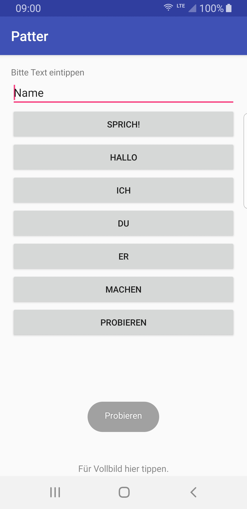

# Patter

This app uses TTS to read the predefined or typed words

## Goal

This project is build to prototype

 - Android Java implementation
 - dynamic list creation
 - Android TTS
 
## Screenshot

